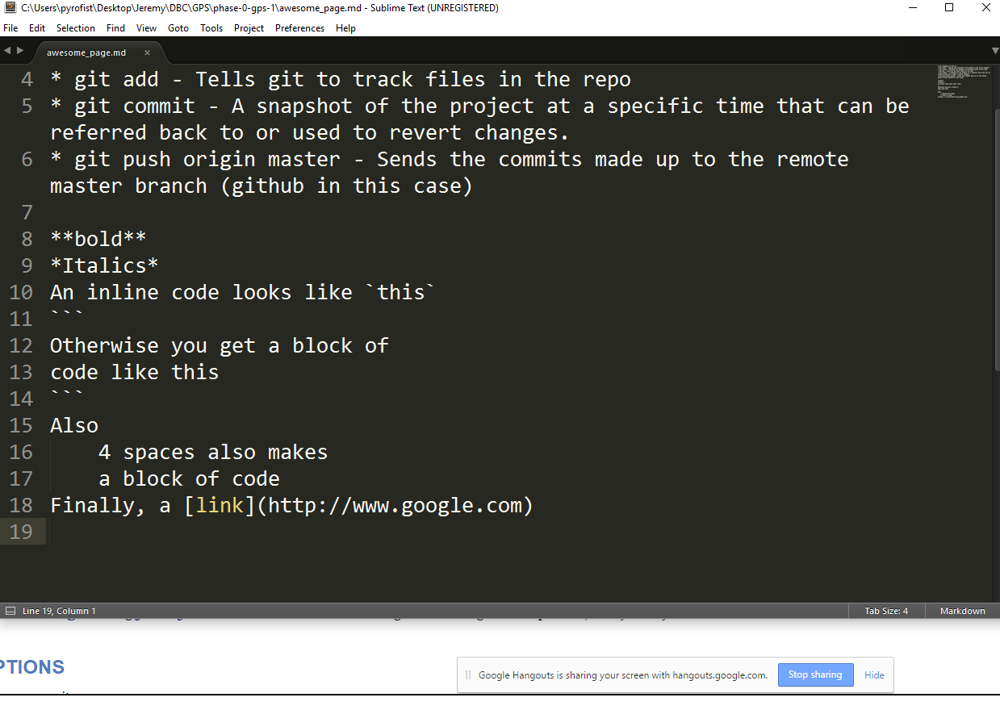

# Git commands for GPS 1.1
* git clone - Copying the repository from github to the local computer
* git status - Checking the changes and untracked files in the repo
* git add - Tells git to track files in the repo
* git commit - A snapshot of the project at a specific time that can be referred back to or used to revert changes.
* git push origin master - Sends the commits made up to the remote master branch (github in this case)

**bold**
*Italics*
An inline code looks like `this`
```
Otherwise you get a block of
code like this
```
Also
    4 spaces also makes more stuff like
    4 spaces also makes something like
    a block of code
Finally, a [link](http://www.google.com)

pics or this didn't happen- 
josh's merge conflict

new change in master
